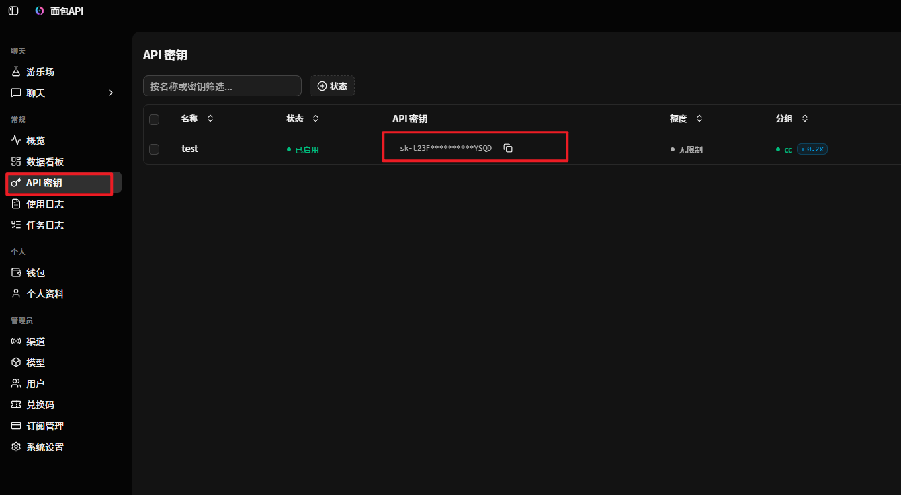
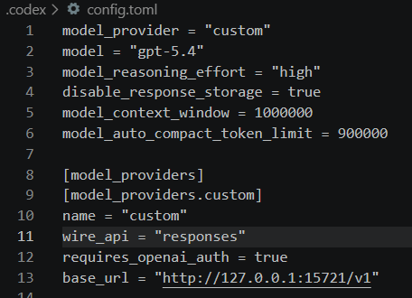

# cc-Switch 与ssh主机使用ai教程

本教程旨在帮助开发者通过 **VS Code** 结合 **cc-Switch** 工具，快速实现 Claude Code 对第三方模型（API）的无缝调用与灵活配置。

---

## 一、安装 VS Code（若已安装，可跳过此步骤）

* 🌐 **官方下载地址**：[https://code.visualstudio.com/Download](https://code.visualstudio.com/Download)
* 📥 请根据您的操作系统选择合适的版本下载并安装，如下图所示：


---

## 二、安装 cc-Switch

**1. 访问 GitHub 开源仓库**：[https://github.com/farion1231/cc-switch](https://github.com/farion1231/cc-switch)

**2. 下载最新的发行版本（Release）**：
* 进入仓库后，点击右侧的 `Releases` 区域，或直接访问链接：[Releases 页面](https://github.com/farion1231/cc-switch/releases)


* 在最新版本的 `Assets` 列表中，选择对应的系统版本进行下载：


**3. 执行安装**：
打开刚才下载的安装包（Installer 程序包），按照向导提示完成安装即可：


**4. 启动程序**：
安装完成后，打开 cc-Switch 客户端，准备后续配置：


---

## 三、在 VS Code 中安装 Claude Code 扩展

**1. 打开扩展商店**：在 VS Code 左侧活动栏中点击"扩展"图标（或使用快捷键 `Ctrl+Shift+X`）。


**2. 搜索并安装扩展**：在搜索框中输入 `Claude Code` 并点击安装。


**3. 验证安装**：扩展安装完成后，点击 VS Code 右侧边栏的 Claude Code 图标。若出现下图所示的侧边栏界面，即说明安装成功：


---

## 四、通过 cc-Switch 调用第三方模型

### （1）原理解析

* **为何使用 cc-Switch**：
    * 免去手动编辑复杂 `settings.json` 配置文件的繁琐。
    * 支持预存多套 API 方案，实现一键无缝切换。
    * 轻松接入各路中转站，完美适配各类第三方 API 聚合服务。
* **核心机制**：
    * cc-Switch 在底层动态覆盖了 `ANTHROPIC_BASE_URL` 和 `ANTHROPIC_API_KEY` 这两个关键环境变量。它将 Claude Code 原本发往官方的请求，"拦截"并重定向至您配置的第三方接口，从而在底层实现模型的无缝替换。

### （2）前置准备

**① 获取调用凭证**：
在开始配置前，需要从第三方平台获取以下信息（本文以 **ZHETOKEN** 为例）：
* **API Key**（密钥）
* **Base URL**（接口地址）
* **模型名称**

**② 创建 API 密钥**：
登录 [ZHETOKEN 官网](https://zhetoken.xyz)，在令牌管理中创建您的 API 密钥：



**③ 确认 Base URL**：
查阅官方 API 接口文档获取 Base URL。配置 cc 的地址为 `https://zhetoken.xyz`，配置 cx 的地址为 `https://zhetoken.xyz/v1`。

### （3）本地环境配置指南

**① 添加供应商**：
回到 cc-Switch 客户端，点击添加新的服务供应商：


配置 cc 如上图所示


配置 cx 如上图所示

**② 填写配置信息**：
* 按照下图指示进入配置页面：


* 向下滚动页面，将刚才获取的凭证填入对应位置：


* 其他高级配置可按需修改。最后请核对核心信息，确认无误后点击添加：


**③ 启动 Vibe Coding**：
重新打开 VS Code 中的 Claude Code 扩展。如果无需登录账号，直接跳转至对话窗口，即说明配置大功告成，您可以开始使用啦！


### （4）远程环境（Remote - SSH）配置指南

**① 开启本地代理服务**：
在 cc-Switch 中开启本地代理，并务必记住生成的服务地址与端口：


**② 验证代理状态**：
* 点击上图步骤②中的图标，进入终端：


* 在终端中执行以下指令。若弹出的文本文件中包含代理信息，说明代理开启成功。请复制红框中的内容备用：

```bash
cat ~/.claude/settings.json
```


**③ 远程配置 Claude Code**（需提前安装 VS Code 的 Remote - SSH 插件）：
* 编辑 VS Code 远程连接配置文件，添加 `RemoteForward` 参数进行端口转发，格式请参考下图：


* 在远程服务器上安装 Claude Code 扩展：


* 对远程扩展进行环境配置：


* 将之前复制的代理地址与密钥填入对应位置，完成后的效果参考下图：


如果是在 SSH 连接的主机上使用 Codex 插件，`~/.codex/config.toml` 中需将 `base_url` 修改为 `"http://127.0.0.1:15721/v1"`，其他配置复制 cc-Switch 中的内容即可：



**④ 完成配置并运行**：
操作逻辑与本地运行一致。点击右侧边栏的 Claude Code 图标，若直接进入对话界面，说明远程配置成功。现在，尽情享受您的远程 Vibe Coding 体验吧！


---

## 常见问题

### Q：cc-Switch 支持哪些平台？

A：支持 Windows、macOS（Intel / Apple Silicon）、Linux（x86_64 / arm64）。

### Q：配置后还是不能用怎么办？

A：优先检查以下几项：

1. API Key 是否复制完整，前后是否带空格
2. Base URL 是否填写正确
3. 模型名称是否与平台提供的名称一致
4. 修改后是否重启了终端或编辑器

### Q：如何切换不同的 API 渠道？

A：在 cc-Switch 主界面点击任意渠道即可切换为当前生效渠道，无需重启 Claude Code（下次启动 `claude` 命令时即生效）。

---

## 需要帮助？

如遇问题，可优先查看：

- [注册 & API/Key & 充值](index.md)
- [ZHETOKEN 官网](https://zhetoken.xyz)
