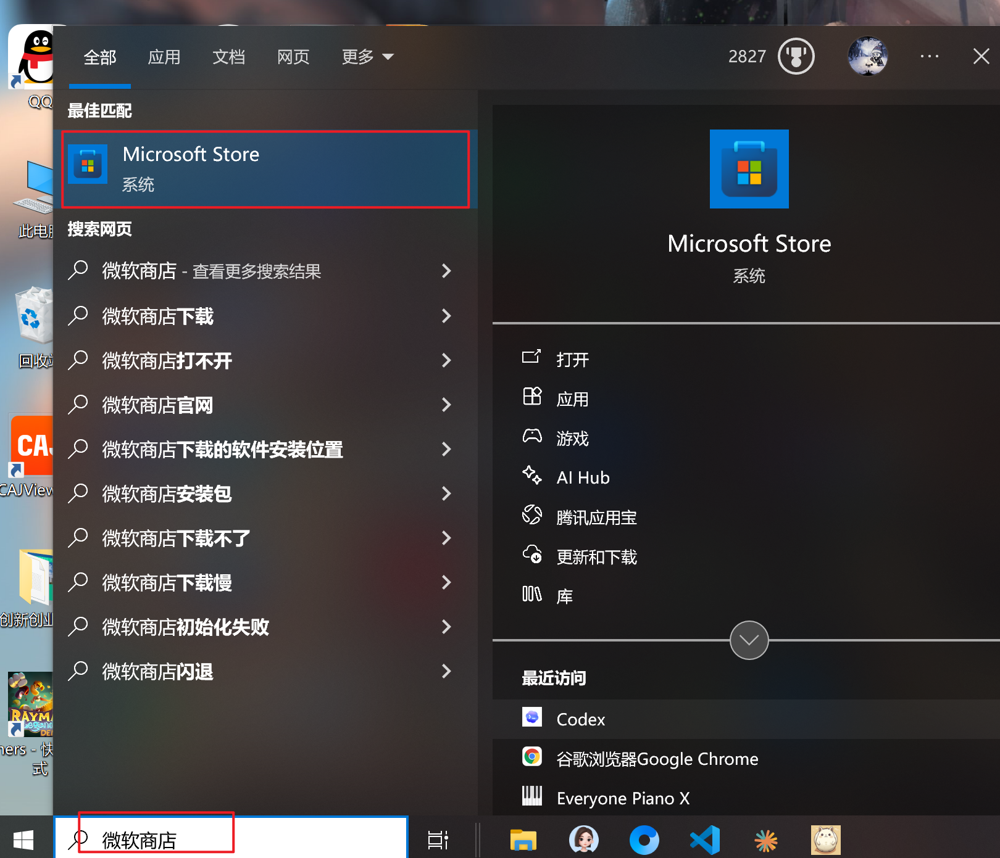
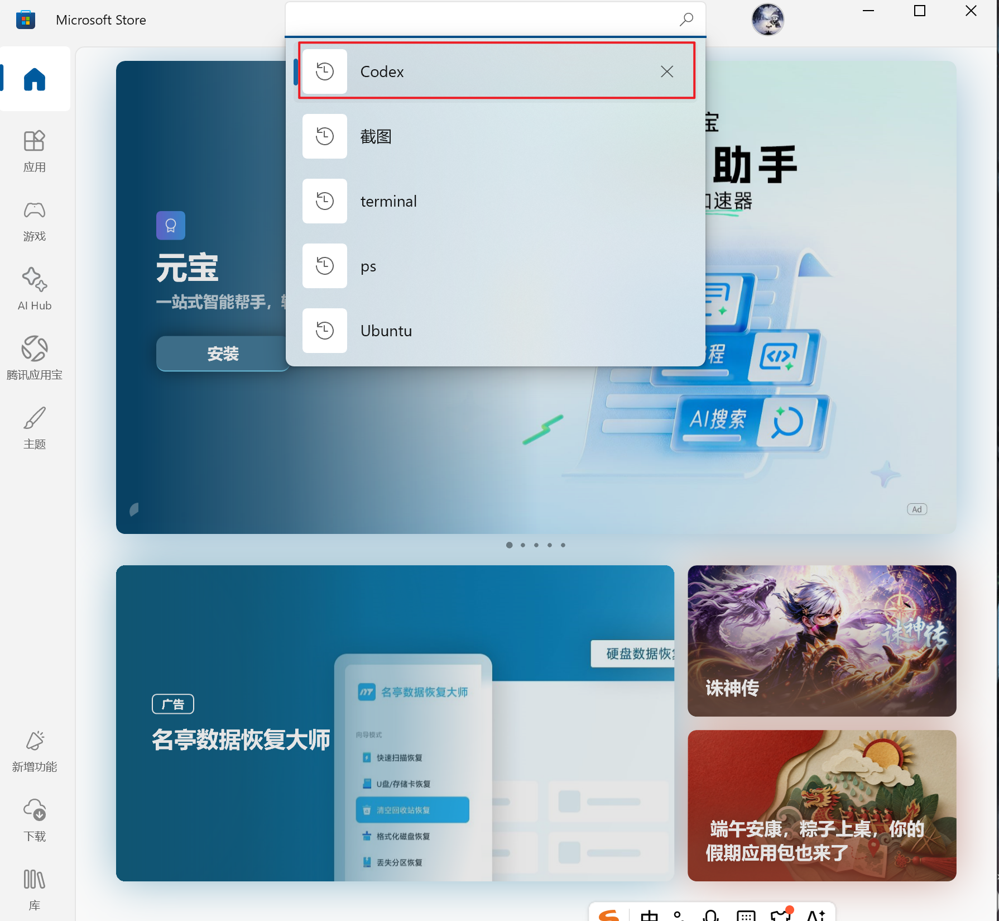
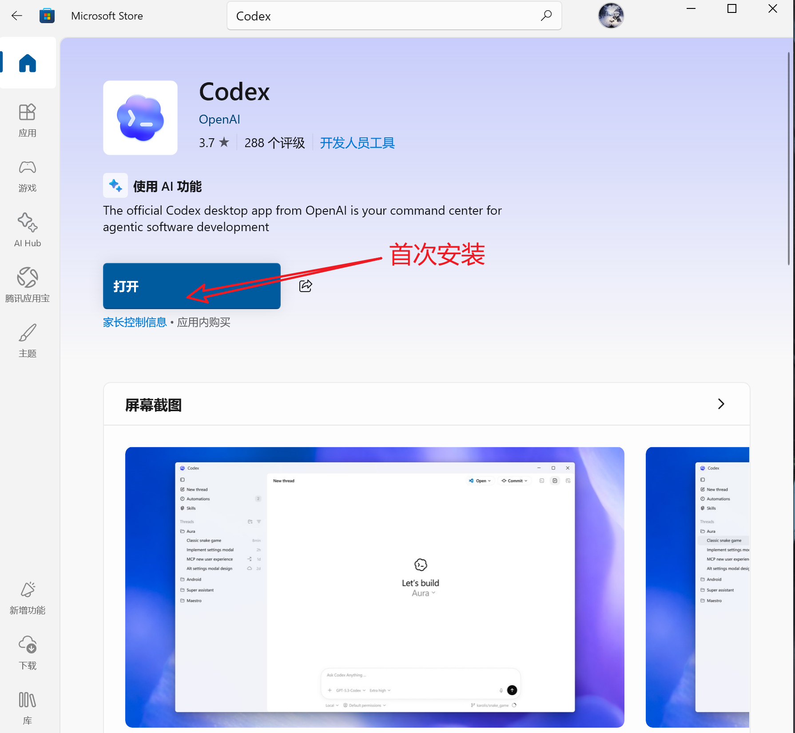
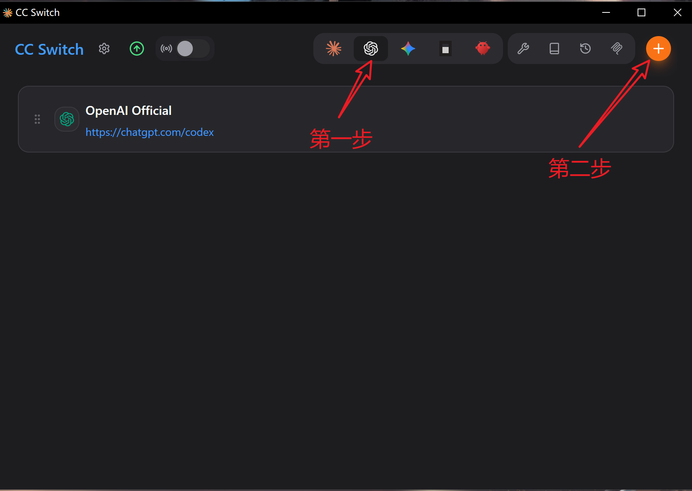
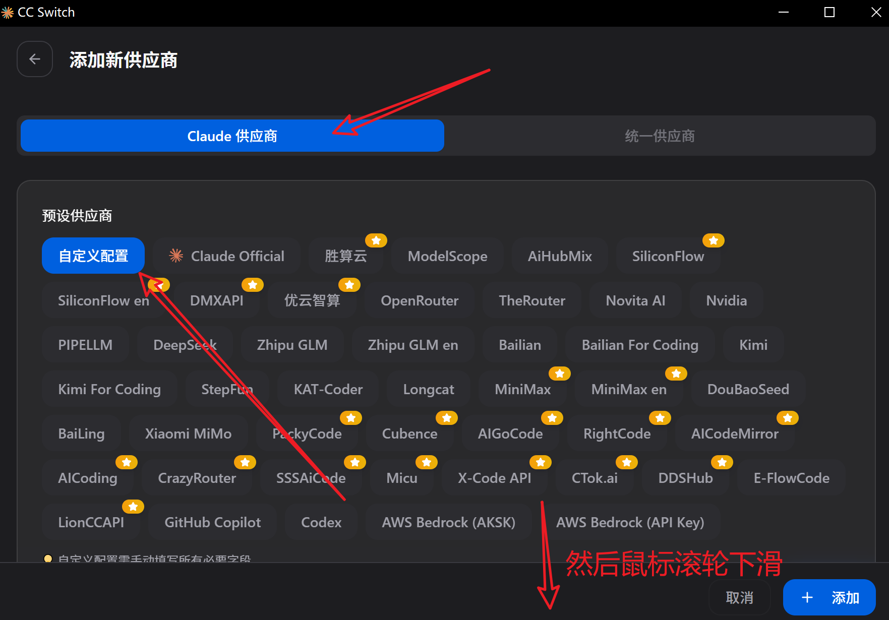
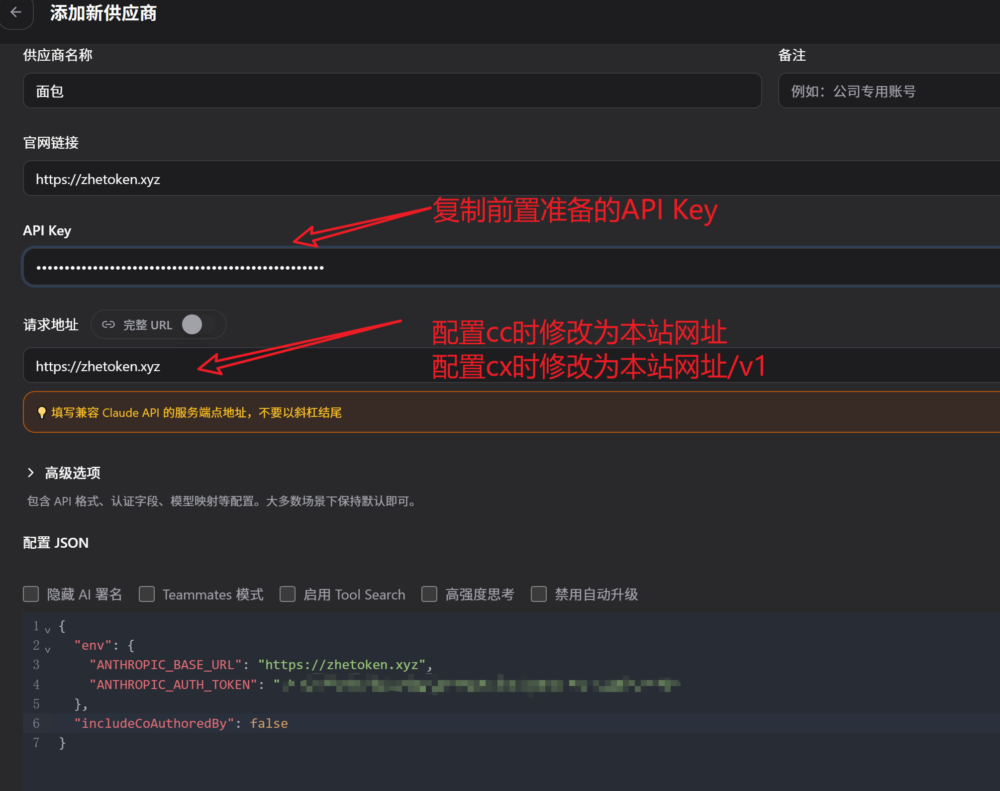

# Codex CLI 配置教程

---

## 第一部分：Codex 客户端 + cc-Switch（新手最推荐）

此方法无需命令行，图形界面操作，适合新手快速上手。

### 第一步：打开微软应用商店

在 Windows 搜索栏中搜索「微软商店」并打开：



### 第二步：搜索 Codex

在微软商店搜索框中输入 `Codex` 并搜索：



### 第三步：下载安装 Codex

点击下载并安装 Codex 客户端：



### 第四步：打开 cc-Switch

安装 cc-Switch：

1. 访问 GitHub 开源仓库：[https://github.com/farion1231/cc-switch](https://github.com/farion1231/cc-switch)
2. 下载最新的发行版本（Release）：进入仓库后，点击右侧的 `Releases` 区域，或直接访问：[Releases 页面](https://github.com/farion1231/cc-switch/releases)

安装完成后打开 cc-Switch 客户端：



### 第五步：配置 cc-Switch

在 cc-Switch 中填写配置信息（API Key 和请求地址）：



### 第六步：复制 API Key 和请求地址

从面包API控制台复制 API Key 与请求地址，填入上一步的配置框中：

- **Codex 请求地址**：`https://zhetoken.xyz/v1`



### 第七步：重启 Codex 客户端

配置好 cc-Switch 后重启 Codex 客户端，即可无需登录直接使用。

---

## 第二部分：Codex CLI 命令行配置

欢迎使用 ZHETOKEN。本教程帮助你通过命令行方式完成 Codex 配置并开始使用。

## 快速导航

- [第一步：获取 Codex API Key](#step-1)
- [第二步：选择使用方式](#step-2)
- [方案 A：命令行工具（推荐）](#cli-guide)
- [方案 B：编辑器插件](#plugin-guide)
- [常见问题](#faq)

---

## 第一步：获取 Codex API Key {#step-1}

### 1. 登录控制台

访问控制台：[https://zhetoken.xyz](https://zhetoken.xyz)

登录后可以看到：

- 账户余额
- 充值入口
- API 信息
- 令牌管理

### 2. 充值

如需充值，可直接在站内选择充值金额并完成支付。

!!! warning "注意"
    付款后请等待页面明确提示支付成功，再关闭支付窗口，避免出现延迟到账。

### 3. 获取 API Key

在左侧 **令牌管理** 中点击 **添加令牌**，填写名称并选择分组后创建。

创建完成后，在 **密钥** 一栏点击复制即可。

!!! warning "重要"
    创建令牌时务必先选择分组。大量“可用但请求失败”的情况都与未选分组有关。

---

## 第二步：选择使用方式 {#step-2}

Codex 常见有两种使用方式，可按你的使用习惯选择：

| 方式 | 适合人群 | 特点 |
|------|----------|------|
| 命令行工具（推荐） | 日常开发、终端用户 | 功能完整，官方支持，响应直接 |
| 编辑器插件 | IDE 内使用 | 集成在 VS Code / Cursor 等编辑器中 |

推荐优先使用命令行工具。功能更完整，也更接近官方原生体验。

两种方式可以同时使用，互不影响。

---

## 方案 A：命令行工具（推荐） {#cli-guide}

### 环境要求

- Node.js 16 或更高版本
- npm
- Git

### 安装步骤

#### 1. 安装 Codex CLI

```bash
npm install -g @openai/codex
```

如遇权限问题：

- macOS / Linux：不要直接使用 `sudo`，建议先修复 npm 全局目录权限
- Windows：以管理员身份运行 PowerShell 或终端

#### 2. 验证安装

```bash
codex --version
```

输出版本号即表示安装成功。

#### 3. 配置 API Key

使用一键配置脚本：

- [Windows 脚本（.bat）](codex-config.bat){ download="codex-config.bat" }
- [macOS / Linux 脚本（.sh）](codex-config.sh){ download="codex-config.sh" }

运行方法：

- Windows：双击 `codex-config.bat`，或在终端中执行 `.\codex-config.bat`
- macOS / Linux：在终端中执行 `sh codex-config.sh`

脚本可在任意目录执行，会自动写入 `~/.codex` 或 `%USERPROFILE%\.codex` 配置。

#### 4. 开始使用

```bash
codex
```

启动后即可直接和 AI 助手对话。

---

## 方案 B：编辑器插件 {#plugin-guide}

### 支持的编辑器

- VS Code
- Cursor
- Windsurf

### 安装步骤

#### 1. 安装插件

在编辑器扩展市场搜索 `Codex`、`ChatGPT` 或兼容的 OpenAI / Codex 插件并安装。

#### 2. 配置 API Key

你可以使用下面两种方式：

##### 方式 1：使用一键配置脚本（推荐）

下载并运行配置脚本，自动完成本机 Codex 配置：

- [Windows 脚本（.bat）](codex-config.bat){ download="codex-config.bat" }
- [macOS / Linux 脚本（.sh）](codex-config.sh){ download="codex-config.sh" }

运行后按提示粘贴 API Key 即可。

##### 方式 2：手动配置

找到 `.codex` 文件夹下的 `config.toml` 文件（路径通常为 `~/.codex/config.toml` 或 `%USERPROFILE%\.codex\config.toml`），将其中内容修改为 cc-Switch 中显示的对应配置即可。

#### 3. 开始使用

配置完成后，即可在编辑器内打开侧边栏、命令面板或聊天窗口开始使用。

---

## 常见问题 {#faq}

### Q：配置脚本必须在特定目录运行吗？

A：不需要。脚本可以在任意目录运行，会自动写入正确的 Codex 配置目录。

### Q：Codex 的 Base URL 应该填什么？

A：填写 `https://zhetoken.xyz/v1`。注意 Codex 必须带 `/v1` 后缀。

### Q：插件和 CLI 可以同时使用吗？

A：可以。它们通常共用同一套本地 Codex 配置，互不冲突。

### Q：远程开发（SSH）如何配置？

A：在远程服务器上重新运行一次配置脚本即可。远程环境和本机环境的配置文件是分开的。

### Q：配置后还是不能用怎么办？

A：优先检查以下几项：

1. API Key 是否复制完整，前后是否带空格
2. 令牌创建时是否正确选择了分组
3. Base URL 是否填写为 `https://zhetoken.xyz/v1`
4. 修改后是否重启了终端或编辑器

### Q：如何更新 API Key？

A：重新运行一键配置脚本，或手动修改 `auth.json` 中的 `OPENAI_API_KEY`。

---

## 需要帮助？

如遇问题，可优先查看：

- [首页](index.md)
- [ZHETOKEN 官网](https://zhetoken.xyz)
