# AI 科研辅助

本页面展示如何借助 AI 辅助科研工作，涵盖代码作图、期刊图片风格调整与科研 Skills 推荐三个常用场景。

---

## 一、科研代码作图

向 AI 下达作图需求时，明确标注「数据路径 + 输出格式 + 投稿场景 + 风格要求」四大要素，指定输出可直接运行的 ipynb 代码与 SVG 矢量图，AI 即可自动匹配期刊出版标准的排版、字体与配色规范，大幅降低科研作图的手动调参与格式美化成本。

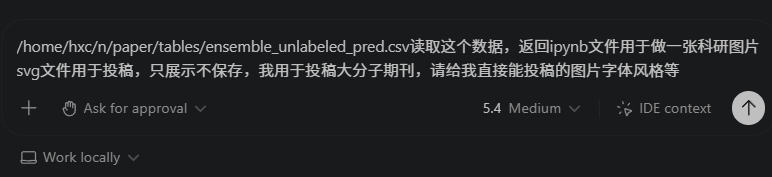

AI 生成的期刊级联合分布图：采用六边形分箱热力图呈现折射率与阿贝数的负相关分布规律，解决大数据量下散点重叠的问题；搭配边际直方图同步展示单变量的数据密度特征，辅以线性拟合趋势线与对数色标。整体字体、配色、版式均符合大分子领域学术期刊的投稿规范，输出为 SVG 矢量格式，可直接用于论文插图。

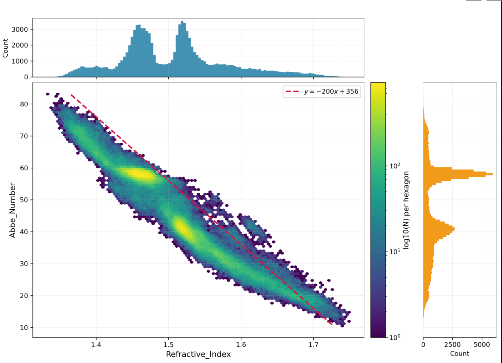

---

## 二、修改目标期刊图片风格

**1. 原始分析底图**：未做出版格式优化的六边形分箱联合分布图，直观呈现聚合物折射率与阿贝数的负相关分布规律。

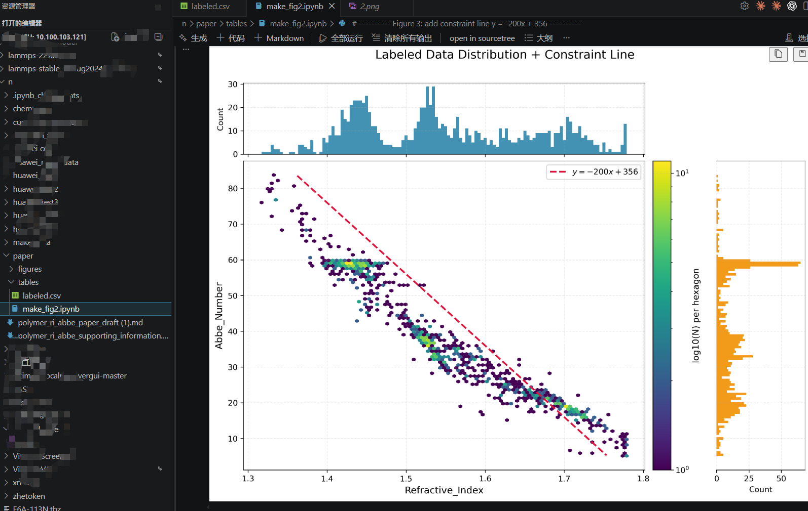

**2. 原始代码与辅助线版本**：Jupyter Notebook 中运行原始绘图脚本，生成带理论约束线的标注数据分布图，保留了数据分析阶段用于趋势参考的辅助元素。

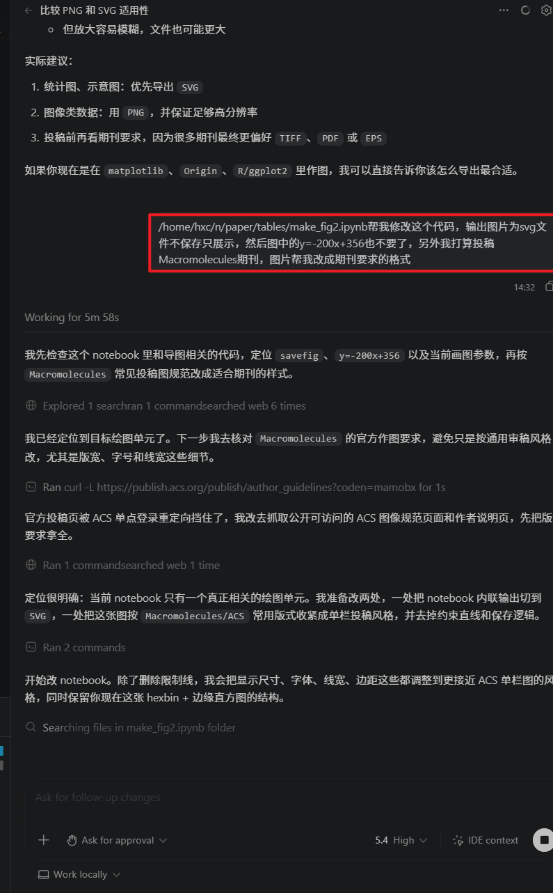

**3. 精准下达期刊格式需求**：向 AI 明确修改指令：移除约束线、输出 SVG 矢量图、适配 *Macromolecules*（ACS）期刊投稿规范，AI 自动检索官方作图标准并规划代码修改方案。

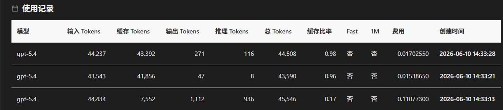

**4. AI 迭代调用消耗明细**：展示格式优化全流程的模型调用记录，多轮代码修改与调试的 token 消耗清晰可查。

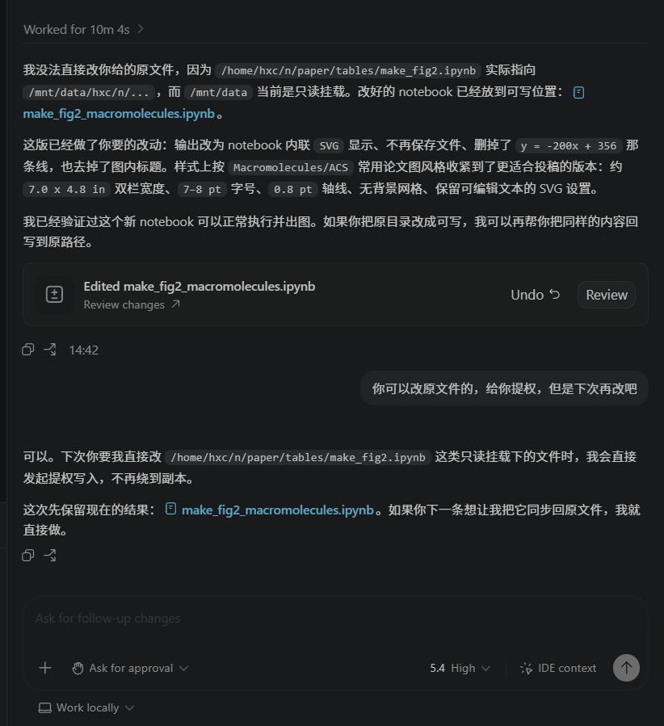

**5. 首轮期刊规范适配交付**：AI 完成首轮代码改造，严格匹配 ACS 期刊双栏尺寸、字号线宽等出版规范，生成支持内联 SVG 预览的新版绘图文件。

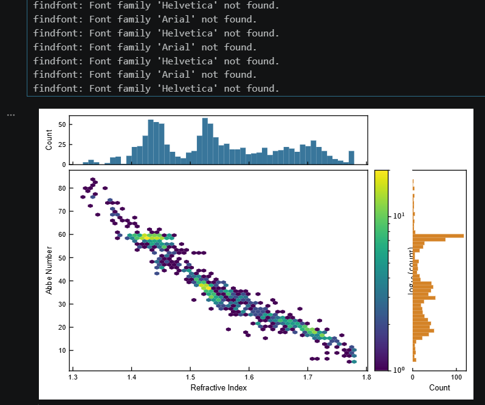

**6. 首轮运行暴露细节问题**：运行修改后代码出现环境字体缺失警告，同时色条标签与右侧直方图发生布局遮挡，暴露出首轮优化的细节瑕疵。

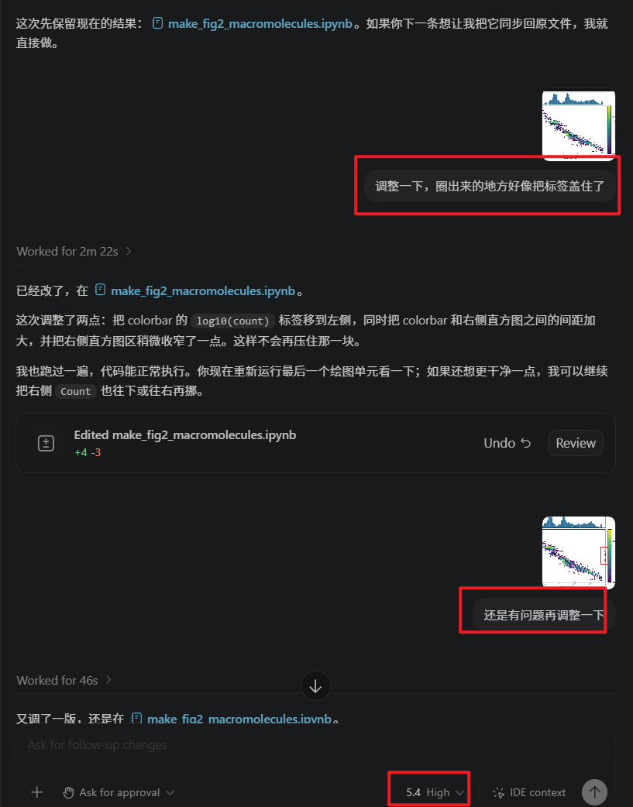

**7. 对话式多轮细节调优**：针对排版问题进行逐点反馈迭代，AI 持续调整色条位置、元素间距，通过多轮对话打磨排版细节，解决标签遮挡问题。

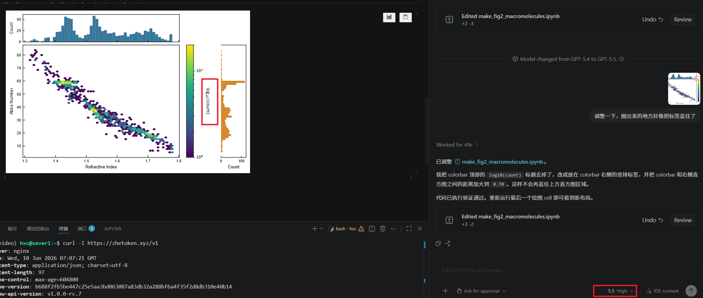

**8. 最终期刊级成图落地**：完成全量布局优化，标签与元素间距符合 ACS 期刊排版标准，最终得到可直接用于 *Macromolecules* 投稿的规范矢量科研图。

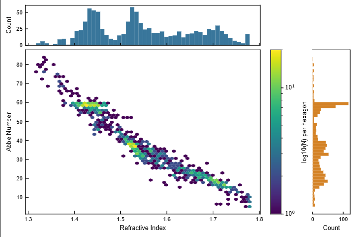

---

## 三、科研 Skills 安装机制与场景推荐

**Skill 加载规则**：AI 不会擅自加载未启用的技能，会先校验当前会话的可用状态；如需新增技能需主动发起安装指令。当前会话已内置全套科研类技能，可直接调用无需额外部署。

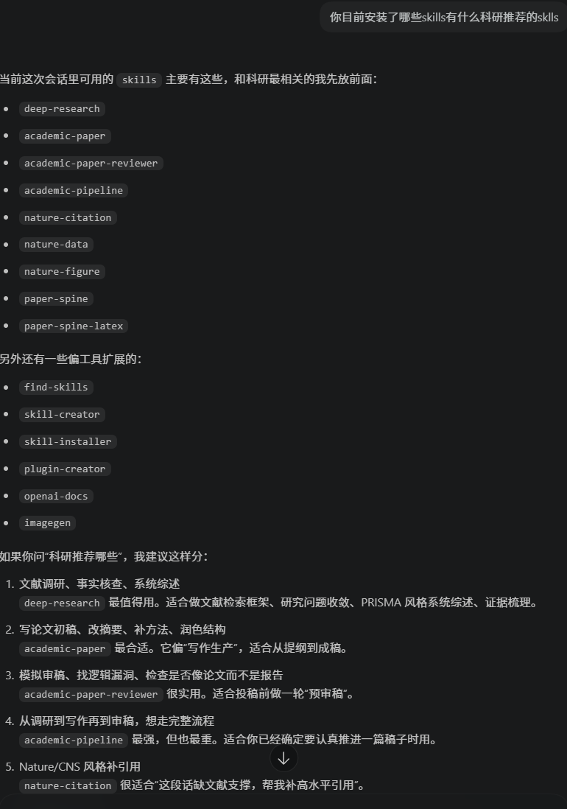

**科研类 Skill 清单与场景化推荐**：按科研全工作流分类推荐：

| Skill | 适用场景 |
|-------|----------|
| `deep-research` | 文献调研与系统综述 |
| `academic-paper` | 论文初稿撰写 |
| `academic-paper-reviewer` | 投稿前预审 |
| `academic-pipeline` | 全流程科研推进 |

此外还提供引文格式、数据处理、绘图等专项技能，可按需匹配不同科研阶段的任务需求。

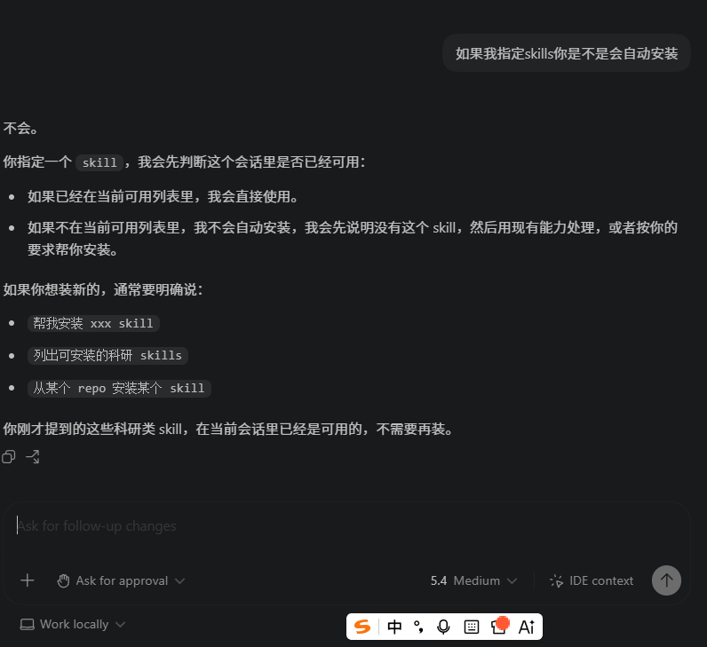
